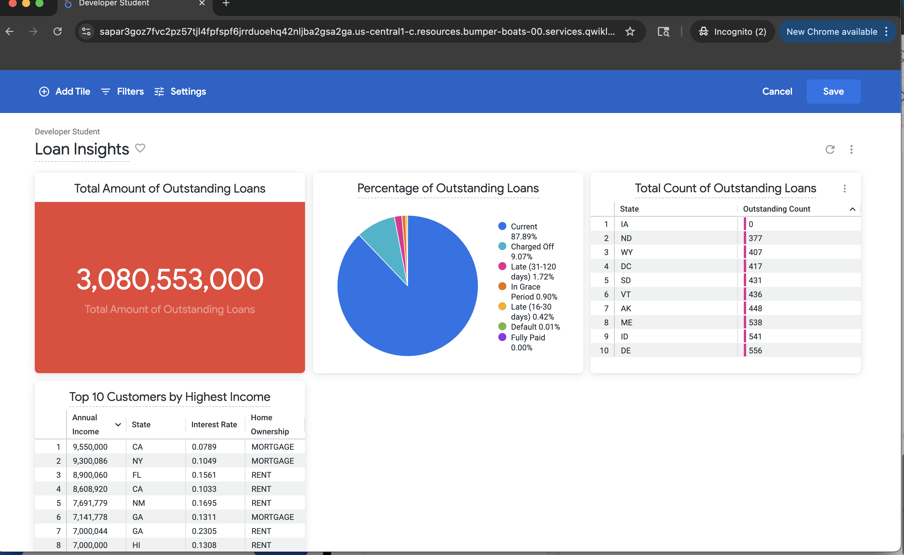

# 📊 Loan Insights Dashboard (Looker / BigQuery)

## 📌 Overview
This dashboard provides a high-level view of loan portfolio health, designed to support risk monitoring, financial oversight, and strategic decision-making. It consolidates loan performance metrics into a single executive-facing view.

Built using **Google BigQuery** as the analytical backend and **Looker** for visualization and reporting.

---

## 🔍 Key Metrics & Visuals

### Total Amount of Outstanding Loans
- Displays total dollar value of active loans  
- Current portfolio exposure: **$3.08B**  
- Enables leadership to quickly assess overall credit exposure  

### Percentage of Outstanding Loans (Loan Status Breakdown)
- Current  
- Charged Off  
- Late (16–30 days, 31–120 days)  
- In Grace Period  
- Default  
- Highlights portfolio risk concentration and early warning signals  

### Total Count of Outstanding Loans by State
- Geographic distribution of loan volume  
- Supports regional risk assessment and compliance analysis  

### Top 10 Customers by Highest Income
- Annual income  
- Interest rate  
- State  
- Home ownership status  
- Useful for pricing and borrower profile analysis  

---

## 🛠️ Technical Implementation
- **Data Source:** BigQuery (loan + customer tables)  
- **Modeling:** Metrics and dimensions defined in LookML  
- **Visualizations:** KPI tiles, tables, pie charts  
- **Refresh Strategy:** Designed for scheduled refreshes  

---

## 💡 Business Value
This dashboard enables stakeholders to:
- Monitor portfolio risk at a glance  
- Identify delinquency trends early  
- Support credit policy and pricing decisions  
- Understand regional and customer-level exposure  

---

## 📸 Dashboard Preview

